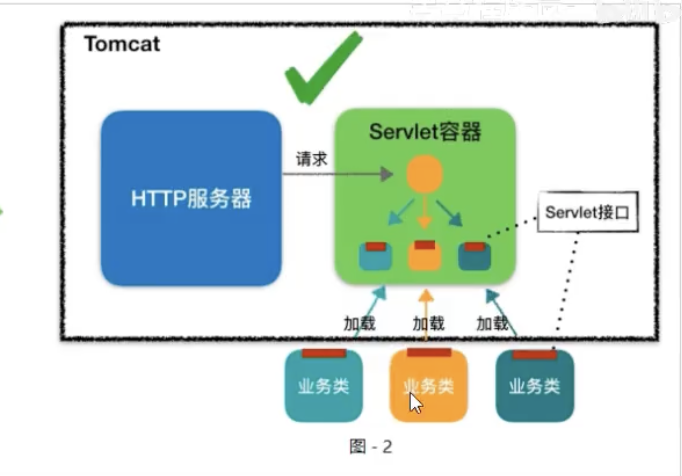
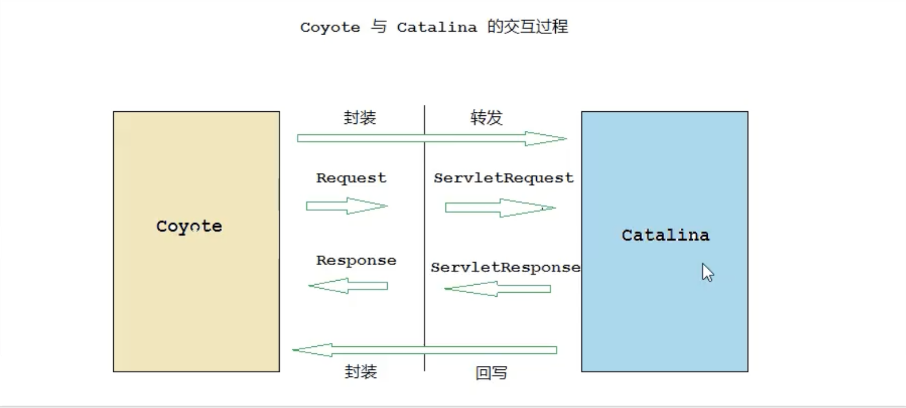
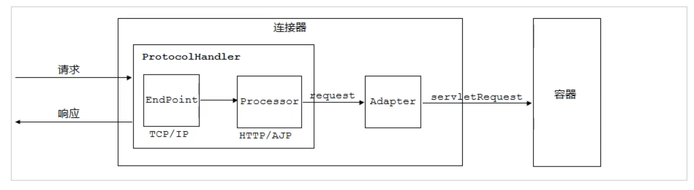
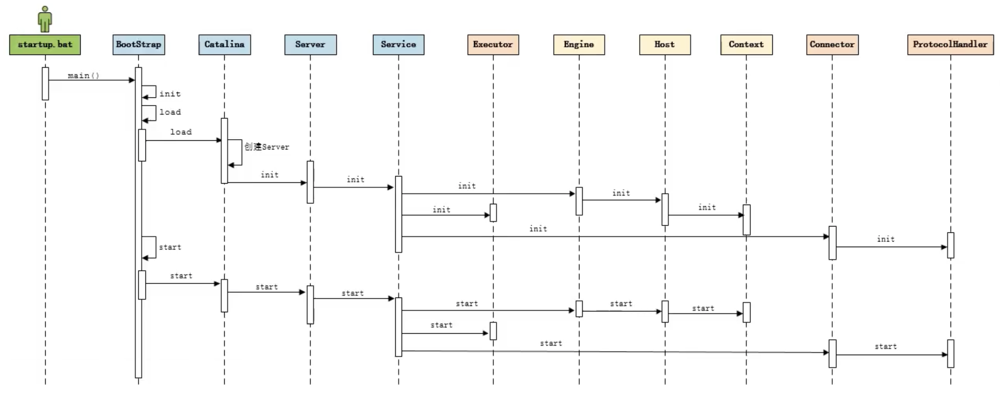
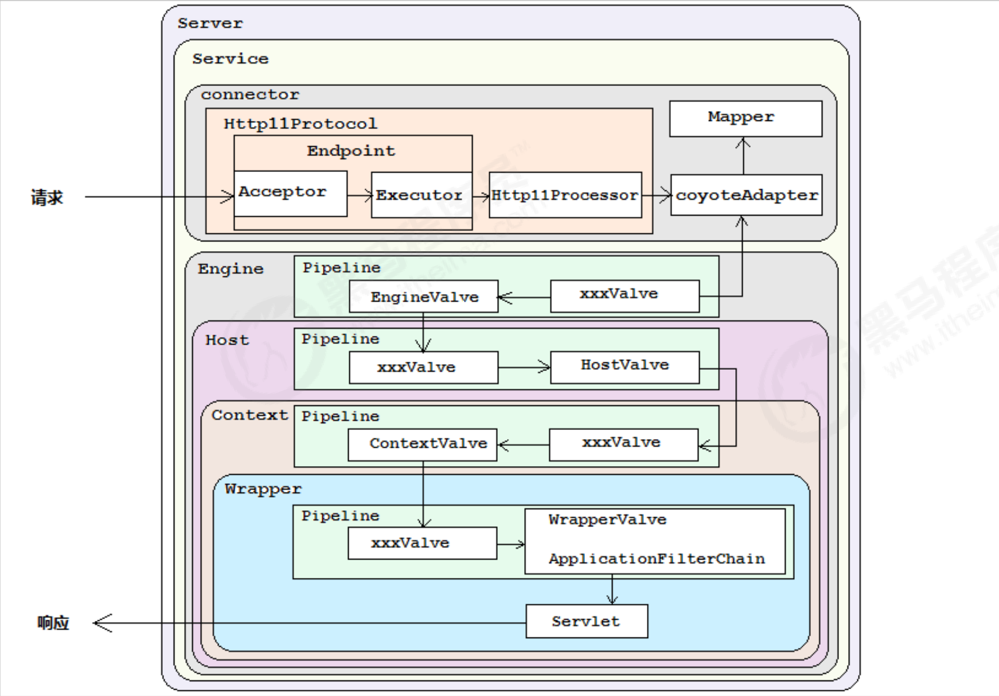

# Tomcat 随堂笔记

## 初步

### 端口
+ 服务关闭端口 8005
+ HTTP连接端口 8080
+ AJP连接端口 8009

### 安装位置
+ windows10
C:\Program Files\Apache Software Foundation\Tomcat 8.5

### 关闭静态资源缓存
1. 配置文件方式
+ web.xml
设置 development 为 true

+ startup.sh
SET CATALINA_OPTS=-server -Xdebug -Xnoagent -Djava.compiler=NONE -Xrunjdwp:transport=dt_socket,server=y,suspend=n,address=5888

## 架构

### 基本结构

### 组件与容器
EndPoint 
    Coyota 的监听端
    用来监听 Socket的端口号和请求

### 时序图

### 请求流程

